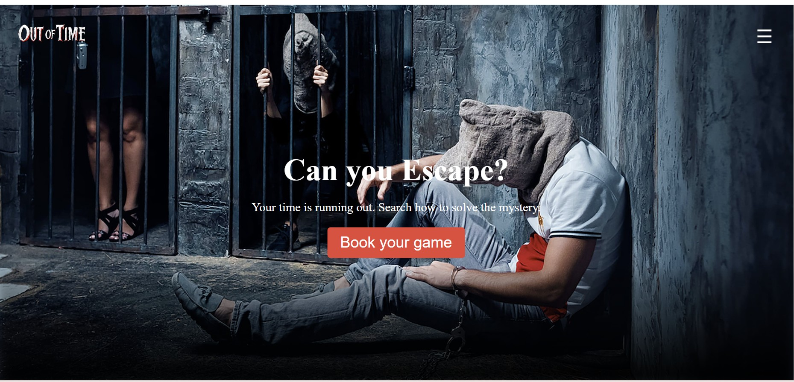
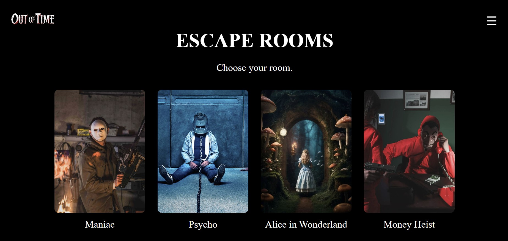
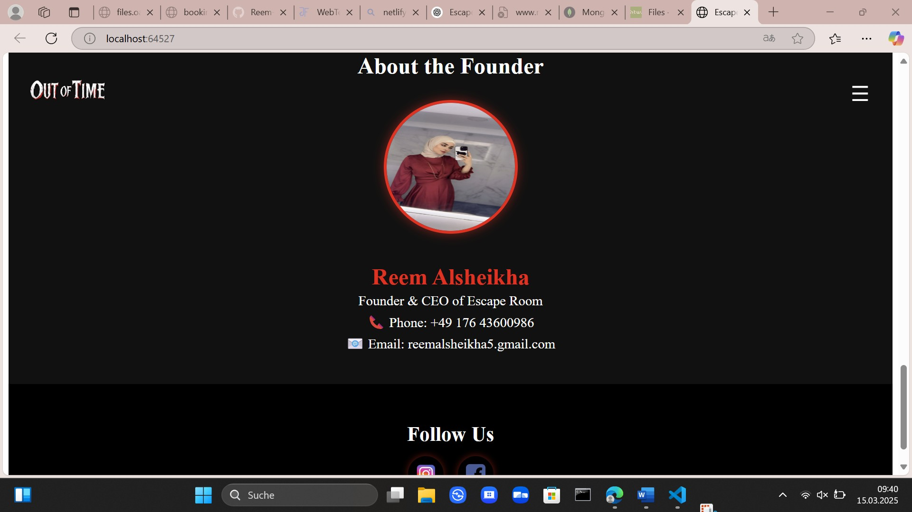
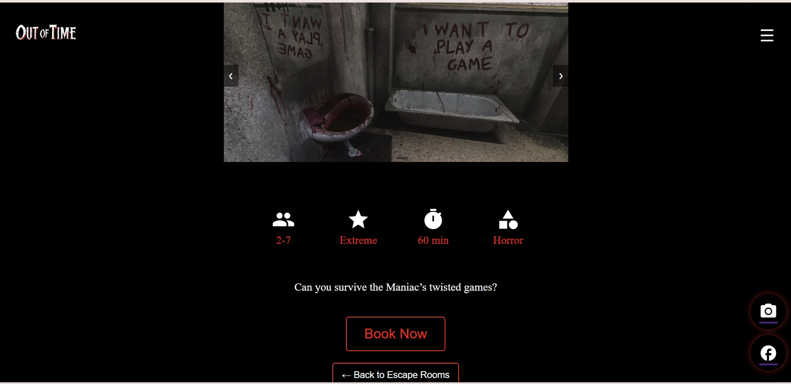
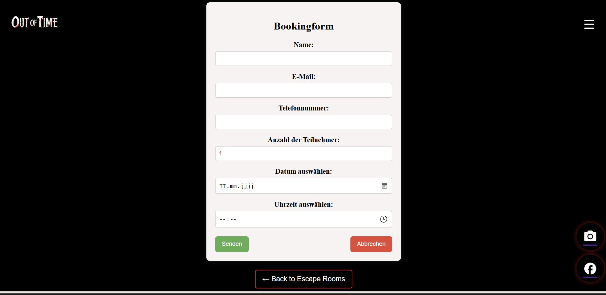
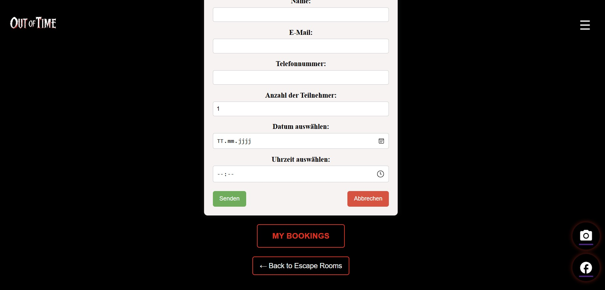
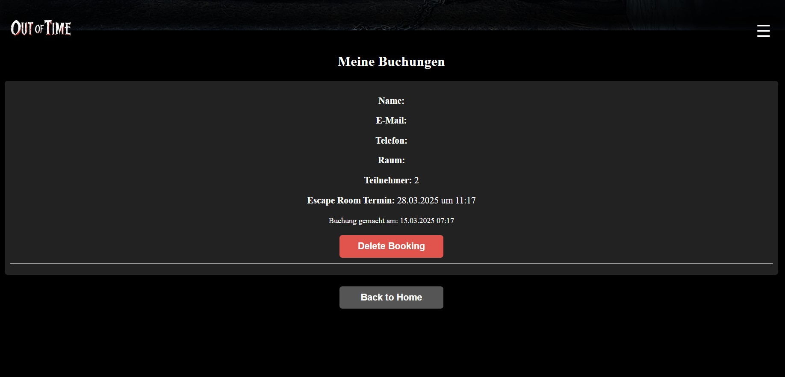

# Escape-room-frontend

Diese Webanwendung simuliert eine Escape Room Buchungsplattform. Nutzer können sich verfügbare Escape Rooms ansehen, Buchungen erstellen .

# Technologie-Stack
- Angular (19.2.1)
- Angular Material & Bootstrap 5.3.3 für UI-Design
- REST-API Kommunikation mit dem Backend
- Responsives Design für Desktop & Mobile

# Installation & Setup

# Voraussetzungen
- Node.js (mind. v18.0.0)
- Angular CLI (mind. v19.2.1)
- Datenbank (MongoDB)

# Schritte zur Installation
- Repository klonen :
https://gitlab.rz.htw-berlin.de/s0591458/escape-room.git
cd escape-room

https://github.com/Reem-Alsheikha/escape-room-frontend.git
cd escape-room

- Abhängigkeiten installieren :
npm install

- Entwicklungsserver starten :
ng serve

Dann die Anwendung unter 'http://localhost:4200/' im Browser öffnen.

# Projektstruktor

escape-room-frontend/
│── src/
│   ├── app/
│   │   ├── components/
│   │   ├── services/
│   │   ├── app.component.ts
│   │   ├── app.routes.ts
│   ├── assets/
│   ├── styles.css
│   ├── index.html
│── angular.json
│── package.json
│── tsconfig.json
│── README.md

# Verwendete Bibliotheken
| Paket               | Version | Beschreibung |
|---------------------|---------|-----------------|
| `@angular/core`     | 19.2.2  | Haupt-Framework |
| `@angular/material` | 19.2.3  | UI-Komponenten  |
| `bootstrap`         | 5.3.3   | CSS-Framework   |
| `rxjs`              | 7.8.1   | Reaktive Programmierung |

# Funktionalitäten

- Escape Rooms anzeigen
- Buchungen erstellen
- Rätsel und Themen anzeigen
- Responsive UI mit Bootstrap 
- Datenbank-CRUD-Operationen

# Deployment

- Netlify
  npm run build
  netlify deploy

# Features 

- Escape Rooms anzeigen
- Informationen über Escape Rooms ansehen
- Buchung erstellen , ansehen, löschen
- Support Kontaktieren

# Weitere Features (zukünftige Erweiterungen)

- Login System für (Kunden und Mitarbeiter)
- Buchungen verwalten (Mitarbeiter)
- Bewertung für Escape Rooms 
- Mehrsprachigkeit

## Screenshots der Anwendung

### Startseite  

### Escape Rooms Seite

### About Us Seite

### Escape Room Details

### Buchungsformular  

### Mein Buchungen Button

### Meine Buchungen  

# Kontakt und Support

Falls Sie Fragen haben, können Sie mich unter folgender E-Mail erreichen:

 E-Mail: reemalsheikha5@gmail.com
 GitLab Repository : Escape-room

